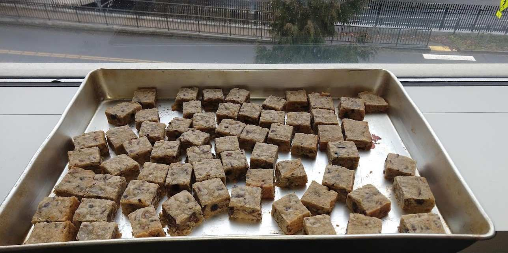

Made blondies from the recipe <https://smittenkitchen.com/2006/11/blondies/>

Added chocolate chips, dried blueberries and rum.
Used the suggestion for adding alcohol, but I didn't have whisky or bourbon, so added rum.
I basically keep a bottle of alcohol for baking projects and didn't realize that rum would be much stronger than the suggestions so these did taste strongly of that flavor. I really liked them!

