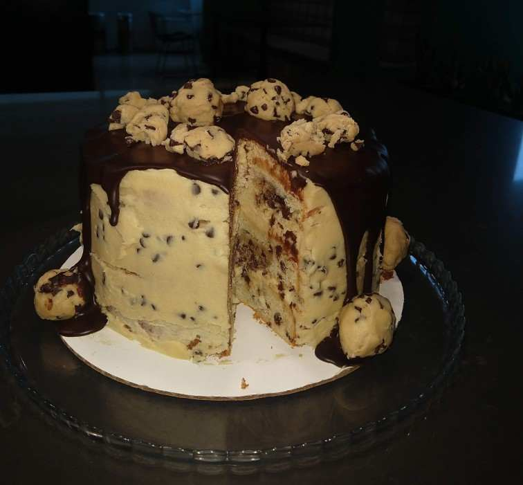

Recipe from <https://butternutbakeryblog.com/cookie-dough-cake/>

Baked a cookie dough cake. Wanted to find a recipe that had cookie dough in the cake layers and this seemed to be the only one. As usual, I found the American butter cream to be too sweet and cut the sugar, even after cutting recipe from original to about about 70%.

Frosting was somewhat gritty as well. Not sure if my mistake on whipping it for lower time or recipe issue due to addition of flour, maybe I'll replace it with a cream cheese based one if I ever make this again. My favorite frosting is this one. <https://www.seriouseats.com/cream-cheese-buttercream-recipe>

Ingredients are sugar, a lot of butter, molasses, flour (heat treated for the raw flour), milk, yogurt, chocolate chips, baking powder, eggs, vanilla, powdered sugar, chocolate, cream, oil, and lemon juice.

One other con of the recipe is that you will encounter some resistance when cutting. I usually leave desserts in my office break room. I usually leave a butter knife but that didn't work for this dessert.
