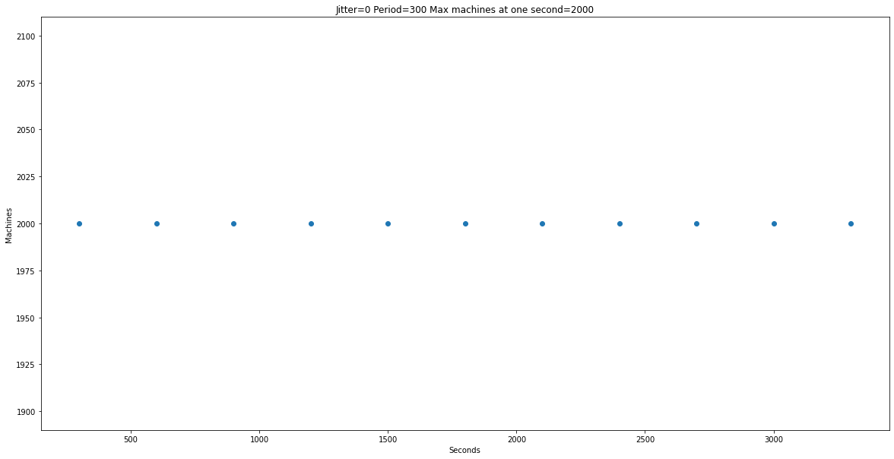
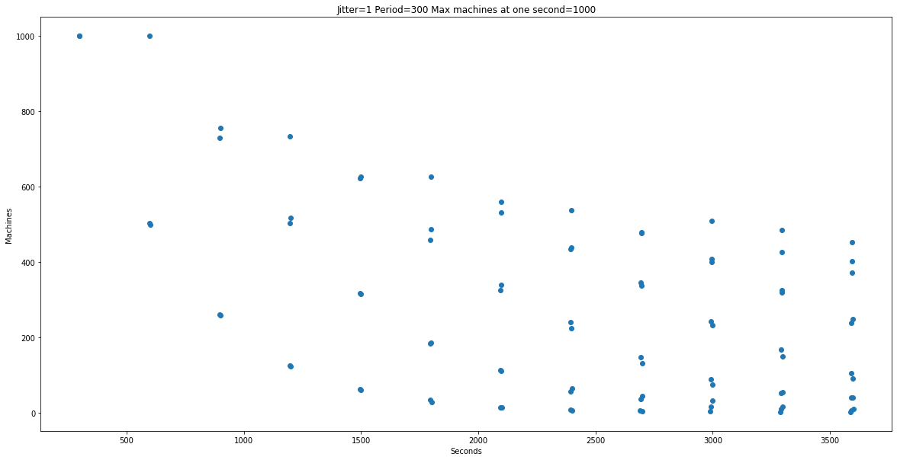
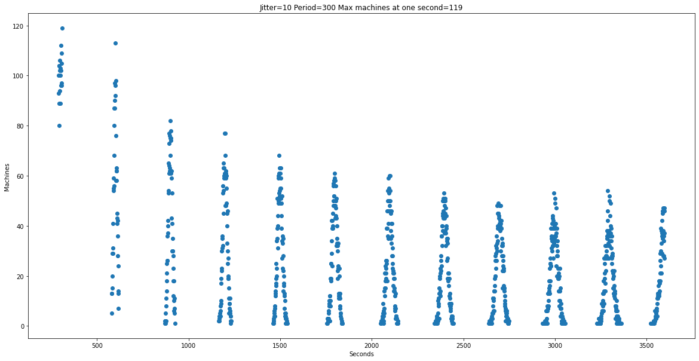

I am usually good about adding jitter on retry timers. I think this is necessary so we don't run into a situation where if server fails due to concurrent clients at one time, we don't coordinate retries at the same time to exacerbate the problem.

But hadn't thought about it from the context of background threads and process startups.
I have usually seen backgrounds threads doing everything from contacting the server to populate some cache, refresh some system token before expiry, cleaning up some cache etc. Usually these are on a fixed timer, like update the background cache every five minutes.

This is usually fine. If you have thousands of machines, the likelihood of them starting at same time is low as deployment has to be staggered after a certain scale. We practice safe deployment!
And there is a natural jitter inherent to the service if you are getting response from a server. However, we had to do a massive service restart recently and seeing  graph like this was uncomfortable.
Simulated with 2000 machines, time period of thread being 300 seconds.


Ever adding one second of jitter reduces peak by half.


10 seconds results in peak reduced by 119.


Problem is that that if you add this at process start, you are intentionally slowing down startup. Doesn't matter much if process starts once and then is running for months, but you'll have to think about your use case.

I don't think you have to worry about this for 99% of the cases. For the .9 % of cases use your standard libraries random number generator and think about adding some random jitter whenever you start a background thread. For the .1%, even this will not help and probably introduces some other bug that I can't think about right now.

Rough Python code to generate the graphs is here

```python
import numpy as np
from matplotlib import pyplot as plt
from numpy.polynomial.polynomial import polyfit
import seaborn as sns

```

```python
minutes = 60
jitter = 0
period = 300
machine_count = 2000
simulation_time = minutes*60
count = (simulation_time//period)+20 
```

```python
class Time_counter:
    def __init__(self, start=0, period=period, jitter=jitter, count=count):
        self.firing_time = np.zeros(count)
        if jitter != 0:
            r = np.random.randint(low=(-1*jitter), high=jitter, size=count)
        else:
            r = np.zeros(count)
        for i, jitter in enumerate(r):
            self.firing_time[i] = self.firing_time[i-1]+jitter+period
    
    def get_firing_time(self):
        return self.firing_time
```

```python
#https://stackoverflow.com/questions/19068862/how-to-overplot-a-line-on-a-scatter-plot-in-python/19069001#19069001
def jitter_and_plot(jitter=jitter):
    x = np.arange(0,simulation_time)
    y = np.zeros(simulation_time)
    for i in range(machine_count):
        m = Time_counter(jitter=jitter)
        for i in m.get_firing_time():
            i = int(i)
            if i < len(y):
                y[i] +=1
    max_machine_count = int(max(y))
    y[ y==0 ] = np.nan
    plt.rcParams["figure.figsize"] = (20,10)
    plt.title("Jitter="+str(jitter)+ " Period=" + str(period)+ " Max machines at one second="+str(max_machine_count)) 
    plt.xlabel("Seconds") 
    plt.ylabel("Machines") 
    plt.scatter(x,y) 
    plt.show()
```
