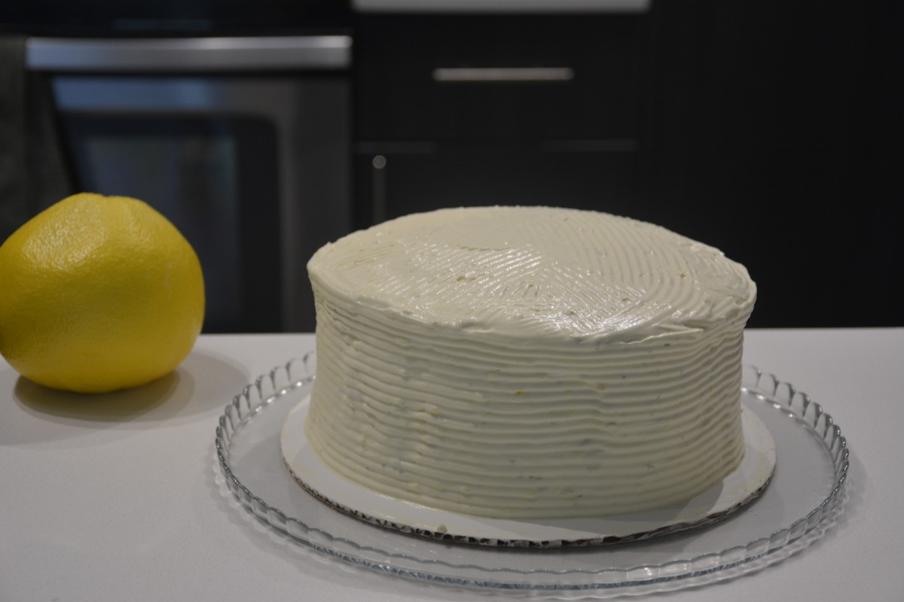

Made a Key west cake with mango mousse and ginger lime cream yesterday. The frosting is essentially whipped cream.

Recipes state that whipped cream will not be stable. I take this to work so that does mean I have to do a quick frosting on Monday morning, rather than taking time with it.

Limes I bought had no juice so subbed with lemon juice. And I realized way too late that Key West probably is referring to Key Limes. Recipe itself states just limes though. I did have the lime zest which I think imparts most of the lime flavor anyway.

I also used frozen mangoes. That was a mistake as I couldn't taste mango at all in the mousse layer. Best mango source I have found is the tinned mango pulp avaialble at Indian Grocery Stores. Try to look for one without added sugar.

This is from Sky High: Irresistible Triple-Layer Cakes by Alisa Huntsman. Closest online I found was http://appleandspice.blogspot.com/2010/07/julys-cake-key-west-cake-with-mango.html but ratio and some small ingredients are different.

Ingredients were eggs, sugar, cake flour, vanilla, butter, rum, mangos, mango extract, gelatin, cream, lime zest, lemon juice, and ginger.

