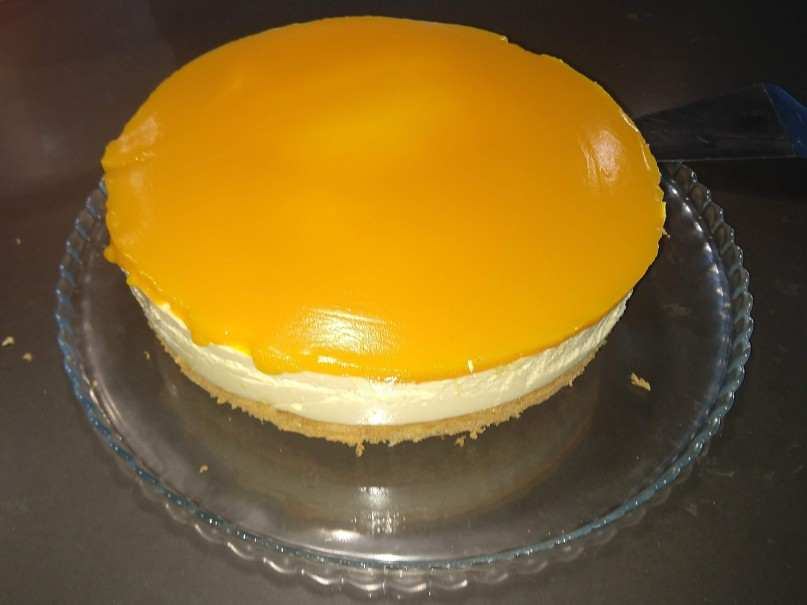

Made mango mousse/no-bake cheese cake. Mixed two recipes. Sponge cake from <https://tatyanaseverydayfood.com/mango-mousse-cake/> and mousse/jelly layer from <https://www.recipetineats.com/no-bake-mango-cheesecake/>

Ingredients are eggs, sugar, vanilla, flour, baking powder, mango puree, gelatin, cream cheese, caster sugar, heavy cream, and lemon juice.
Contains gelatin so not suitable for lacto-ova vegetarians.

It does look visually stunning but I am a bad photographer.
Check the linked recipe blogs for better pictures.
On an unrelated note, make sure to have better lighting when taking food pics.

Not sure I really like the sponge cake layer. I think I prefer the graham cracker crust.

However, I am kinda bad at graham cracker crusts though so wanted to try a cake layer. I think a different cake recipe may work? This one tasted a little too eggy.
Also had made some left over mouse as the cake layer is much taller than the graham cracker layer. Put that in some ramekins and covered with jello for a mouse dessert.
Either they turn out to be too hard i.e. impossible to cut with a plastic utensil.
Or just crumble immediately on the cake tray.
